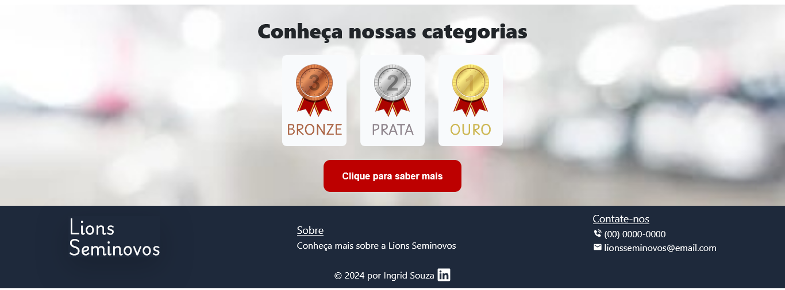

# Lions Seminovos - Landing Page
Este projeto é uma landing page desenvolvida como parte de um desafio front-end, com foco em organização de código, boas práticas de desenvolvimento, acessibilidade e SEO. A aplicação foi construída utilizando React, TypeScript, TailwindCSS, Bootstrap e React Icons, com a intenção de entregar uma interface moderna, responsiva e otimizada para SEO.

## 🖥️ Decisões Tomadas
#### Estrutura do Projeto

Organizei o projeto em diferentes pastas para manter a modularidade e a clareza do código:

* /assets: Imagens e arquivos estáticos utilizados na página.
* /components: Componentes reutilizáveis, como botões e seções específicas.
* /pages: Componentes principais que representam diferentes páginas ou seções maiores da aplicação.
* /styles: Utilizei o Tailwind CSS para estilização, com customização de cores e breakpoints para garantir uma boa responsividade.

#### Acessibilidade e SEO

* Acessibilidade: Usei tags semânticas como  e adicionei descrições em imagens com o atributo alt para garantir que o conteúdo seja acessível a todos.
* SEO: Otimizei o projeto utilizando boas práticas como títulos claros, descrições adequadas, e uma hierarquia de cabeçalhos consistente.

#### Uso do Bootstrap

* Para o menu de navegação responsivo, optei por usar Bootstrap, uma biblioteca robusta e popular para criar layouts responsivos com menor esforço.

#### 🔍 Busca de Palavras

Implementei uma funcionalidade de busca que permite aos usuários procurar palavras-chave específicas.

No menu de navegação, você encontrará um campo de pesquisa.
Digite uma das seguintes palavras-chave:
* Fature
* Lions
* Seminovos
* Parceiros
* Categorias

Clique no botão "Buscar".

Se a palavra estiver na lista, o campo de entrada mudará para verde e uma mensagem de sucesso será exibida. Se a palavra não estiver na lista, o campo mudará para preto e uma mensagem de erro será apresentada.

#### Padrões e Organização

* Implementei uma organização clara de arquivos e componentes, utilizando TypeScript para garantir a tipagem e evitar bugs. Também usei React Hooks (como useState e useEffect) para lidar com eventos e mudanças no layout com base no tamanho da tela.

#### Responsividade

Para garantir que o site seja totalmente responsivo:

* Bootstrap foi utilizado para o menu de navegação, aproveitando seus utilitários e classes de grid.
* Tailwind CSS foi usado para ajustar outros elementos de layout de acordo com os breakpoints definidos.

### 🔥 Screenshots

### 🔨 Guia de instalação
#### Pré-requisitos

    Node.js (v14 ou superior)
    npm ou yarn instalado

#### Instalação:

1. Clone o repositório

        git clone https://github.com/seu-usuario/nome-do-repositorio.git

        cd nome-do-repositorio

2. Instale as dependências:

        npm install ou yarn install

3. Execute a aplicação

        npm run dev ou yarn start

## 📦 Tecnologias usadas:
 
 
 

## 👷 Autores

* **Ingrid Souza** - *Front-End* - [GitHub](https://github.com/IngridsSilveira)